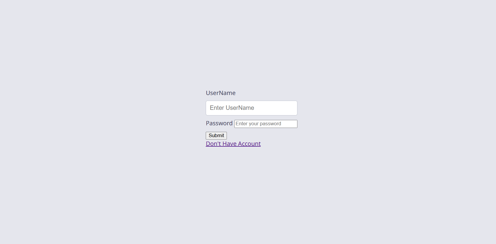
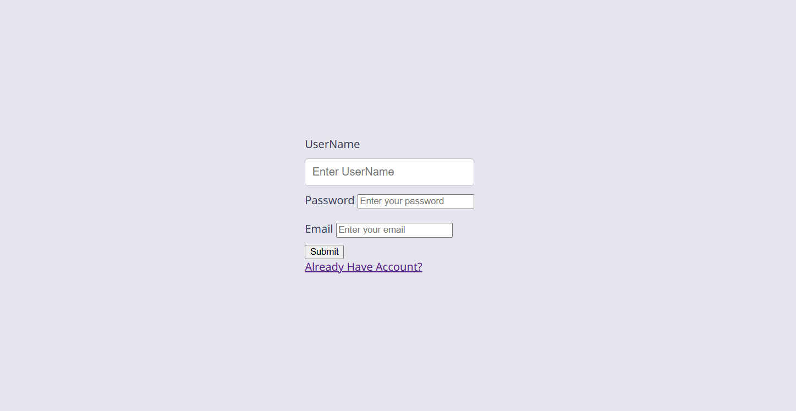
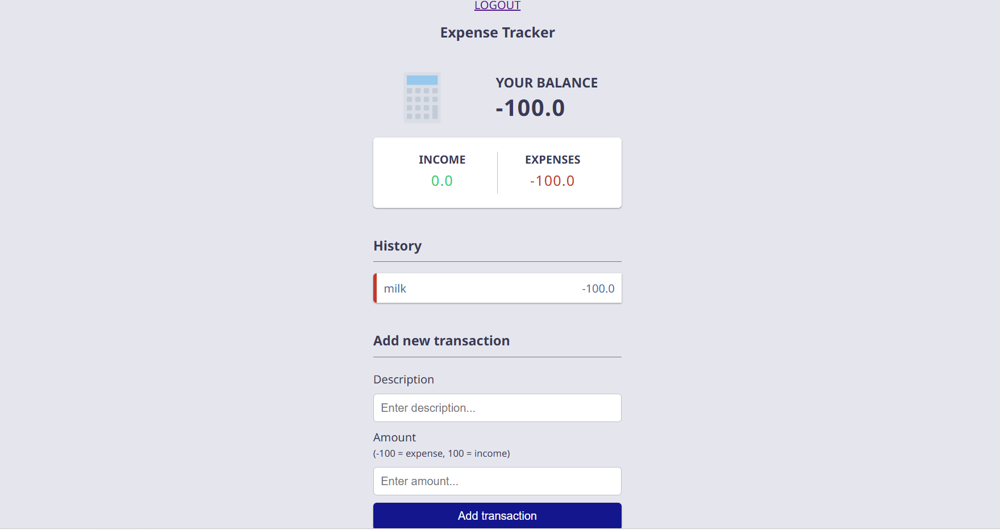

# 💰 Expense Tracker

A simple and secure Expense Tracker built using **Django** that helps users manage their daily income and expenses. The application provides user authentication, transaction management, and real-time balance calculation to keep track of personal finances.

---

## 🚀 Features

- 🔐 User Registration and Login
- 🔒 Secure Authentication using Django Authentication System
- ➕ Add Income and Expense Transactions
- 🗑️ Delete Transactions
- 👤 Each user can access only their own transactions
- 📊 Automatic calculation of:
  - Total Balance
  - Total Income
  - Total Expense
- 🆔 UUID-based transaction identification
- 💬 Success and error messages using Django Messages Framework
- 📱 Clean and responsive user interface

---

## 🛠️ Tech Stack

| Technology | Purpose |
|------------|---------|
| Django | Backend Framework |
| Python | Programming Language |
| HTML | Frontend Structure |
| CSS | Styling |
| Bootstrap | Responsive UI |
| SQLite | Local Database |
| PostgreSQL | Production Database |
| Django ORM | Database Operations |
| WhiteNoise | Static File Serving |
| Gunicorn | Production Server |
| Render | Deployment |

---

## 📂 Project Structure

```
newexpense/
│
├── newexpense/
│   ├── settings.py
│   ├── urls.py
│   └── ...
│
├── tracker/
│   ├── models.py
│   ├── views.py
│   ├── urls.py
│   ├── templates/
│   ├── static/
│   └── ...
│
├── requirements.txt
├── manage.py
└── README.md
```

---

## 📊 Database Design

### Transaction

| Field | Type |
|-------|------|
| uuid | UUID (Primary Key) |
| description | CharField |
| amount | FloatField |
| created_by | ForeignKey(User) |
| created | Date |
| updated | Date |

Each transaction belongs to a specific authenticated user.

---

## ⚙️ Installation

### Clone the repository

```bash
git clone <repository-url>
cd newexpense
```

### Create Virtual Environment

#### Windows

```bash
python -m venv venv
venv\Scripts\activate
```

#### Linux / macOS

```bash
python3 -m venv venv
source venv/bin/activate
```

### Install Dependencies

```bash
pip install -r requirements.txt
```

### Apply Migrations

```bash
python manage.py makemigrations
python manage.py migrate
```

### Create Superuser (Optional)

```bash
python manage.py createsuperuser
```

### Run Development Server

```bash
python manage.py runserver
```

Open your browser and visit:

```
http://127.0.0.1:8000/
```

---

## 📸 Screenshots

Add screenshots here.

### Login



### Registration



### Dashboard



---

## 🔒 Security Features

- Password hashing using Django Authentication
- Login required to access dashboard
- Users can only view their own transactions
- UUID-based transaction IDs
- CSRF protection
- Secure session management

---

## 📈 How It Works

1. Register a new account.
2. Login securely.
3. Add income using positive amounts.
4. Add expenses using negative amounts.
5. Dashboard automatically calculates:
   - Total Balance
   - Total Income
   - Total Expense
6. Delete transactions whenever required.

---

## 📦 Requirements

```
Django
Gunicorn
WhiteNoise
dj-database-url
psycopg2-binary
```

Install all dependencies using:

```bash
pip install -r requirements.txt
```

---

## 🌟 Future Improvements

- Edit Transactions
- Transaction Categories
- Monthly Expense Reports
- Charts and Graphs
- Search and Filter Transactions
- Budget Planning
- CSV/PDF Export
- Dark Mode
- REST API using Django REST Framework

---

## 👨‍💻 Author

**Vansh Garg**

GitHub: https://github.com/Vanshgarg8683

---

## ⭐ Support

If you found this project useful, consider giving it a ⭐ on GitHub.